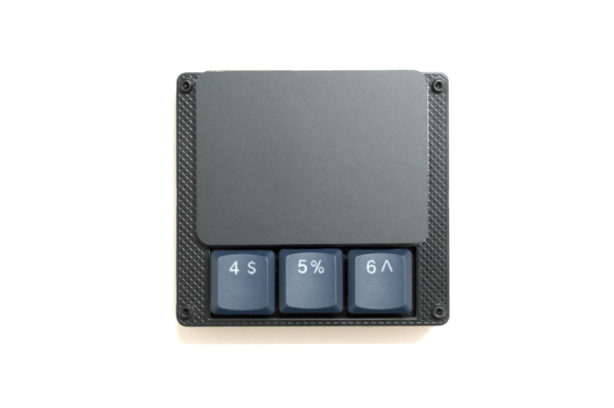

# GR-Trackpad65 experiment kit

The GR-Trackpad65 Experimental Kit is a kit for trying out the [GR-Trackpad65](https://github.com/geek-rabb1t/GR-Trackpad65).

It works as a macro pad with a trackpad for multi-touch support up to 4 fingers.

## Directory structure

This repository contains hardware design data only.

- pcb
    - PCB data designed by KiCAD.

## About Firmware

Vial firmware can be obtained from the following URL

- Vial
    - https://github.com/geek-rabb1t/vial-qmk/tree/grt65_exp_kit/keyboards/geek_rabb1t/grt65_exp_kit

## Build Guide

Please read here.

- https://geek-rabb1t.github.io/grt65-expkit/build_guide

---
# GR-Trackpad65 実験キット

GR-Trackpad65 実験キットは [GR-Trackpad65](https://github.com/geek-rabb1t/GR-Trackpad65) を試すためのキットです。

4本指までのマルチタッチ対応のトラックパッド付きののマクロパッドとして機能します。

## ディレクトリ構造

このリポジトリにはハードウェアの設計データのみ格納しています。

- pcb
    - KiCADで設計したPCBデータ。

## ファームウェアについて

以下のURLにVial対応のファームウェアがあります。

- Vial
    - https://github.com/geek-rabb1t/vial-qmk/tree/grt65_exp_kit/keyboards/geek_rabb1t/grt65_exp_kit

## 組み立て手順

こちらをご覧ください。

- https://geek-rabb1t.github.io/grt65-expkit/build_guide
